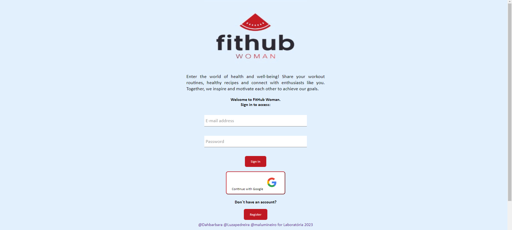

# Social Network: FitHub Woman

## Índice

* [1. Descrição do projeto](#1-descrição-do-projeto)
* [2. Protótipos e histórias de usuários](#2-protótipos-e-histórias-de-usuários)
* [3. Status do projeto](#3-status-do-projeto)
* [4. Funcionalidades e demonstração da aplicação](#4-funcionalidades-e-demonstração-da-aplicação)
* [5. Acesso ao projeto](#5-acesso-ao-projeto)
* [6. Tecnologias utilizadas](#6-tecnologias-utilizadas)
* [7. Desenvolvedoras](#7-desenvolvedoras)

***

## 1. Descrição do projeto

Neste projeto, o terceiro  realizado pelo Bootcamp de Programação e Desenvolvimento Web da Laboratoria, construímos uma Rede Social com a temática hábitos saudáveis entre mulheres. A página web permite que qualquer usuária crie uma conta de acesso, efetue login, gere postagens, edite, delete e dê _likes_ em publicações.

O objetivo principal de aprendizagem deste projeto é construir uma Single-page
Application (SPA), na qual seja possível ler, escrever, e armazenar dados.

## 2. Protótipos e histórias de usuários
Foram elaborados dois tipos de protótipo com a finalidade de deixar a aplicação web o mais intuitiva possível e atingir a perspectiva de centralização na experiência do usuário.

**Protótipo de baixa fidelidade**

**Protótipo de alta fidelidade**

No que diz respeito ao público alvo, as principais usuárias da rede social são mulheres que procuram inspirar umas as outras compatilhando práticas de hábitos saudáveis.

 Criamos as seguintes histórias para desenvolver o projeto:

História de usuário 1:

* Como mulher buscando melhorar minha alimentação, quero fazer uso do FitHub para me motivar vendo o progresso de outras mulheres e encontrar algumas dicas.

História de usuário 2:

* Como iniciante na academia, quero me empoderar das técnicas de alongamento e mobilidade através do que mulheres mais experientes em musculação compartilham, para que assim eu possa evoluir no meus treinos.

## 3. Status do projeto
**Finalizado ✔**

## 4. Funcionalidades e demonstração da aplicação
Ao realizar os testes de usabilidade com usuárias diferentes e passarmos um formulário de sugestões, recebemos alguns feedbacks: melhorar visibilidade do placeholder, reordenar forms (nome, sobrenome, e-mail, senha), trocar ou adicionar ícone ao “incrível” opção de curtir e adicionar ícone de editar ou excluir ao invés de três pontos. Realizamos essas melhorias ***+ (add ao concluir os ajustes).***

No acesso inicial do site os usuários serão direcionados à página de login, a qual possui uma introdução dos objetivo da nossa rede social. Caso a usuária já tenha conta, ela realizará o acesso. Caso contrário, pode-se criar uma nova conta ou ainda logar-se com Google. Acessando a timeline ou feed, visualiza-se posts de outros usuárias com os quais se pode integir e criar seu próprio post.

As aplicações deste projeto são:

* Criar uma conta de acesso, logar-se com ela, criar, editar, deletar e dar likes em publicações.
* Construir uma Single-page Application (SPA) na qual seja possível ler e escrever dados.
* Hospedar/armazenar dados com Firebase.
* Aplicar conceitos de responsividade seguindo o método mobile first.

### 5. Acesso ao projeto
Para acessar o ***fithub WOMAN*** clique aqui: https://fithub-woman.web.app/

### 6. Tecnologias utilizadas
    

### 7. Desenvolvedoras
Dara Coelho  [LinkedIn](https://www.linkedin.com/in/dara-coelho/) | [GitHub](https://github.com/Dahbarbara)

Luza Pedreira [LinkedIn](https://www.linkedin.com/in/luza-pedreira/) | [GitHub](https://github.com/Luzapedreira)

Maria Luiza Mineiro [LinkedIn](https://www.linkedin.com/in/maria-luiza-mineiro/) | [GitHub](https://github.com/malumineiro)
